# GeoTileQuery - Integration, Visualization and Analysis of Georeferenced Data in Unity

## Background

Every day, there are different kinds of challenges that affect a big city like Lisbon, from garbage collection to traffic. To face them, the Centro Operacional Integrado de Lisboa (COI) was established, where smart city management is carried out, through monitoring, analysis, forecasting and operational coordination. Within it there is the situation room, where the most complex scenarios that may occur in the city are monitored, like fires or floods.

To enable a better understanding of the data and collaboration between the decision makers inside or outside the room, the Laboratório de Dados Urbanos de Lisboa (LxDataLab) launched a challenge to create a collaborative decision support tool that uses augmented reality (AR). Given its complexity, this can be split into four stages: integration of the georeferenced data, creation of visualizations for it, interaction with the virtual model in AR and the synchronization of multiple clients.

## About

My MSc dissertation was itself focused on this first stage of data integration. It proposed a framework to integrate georeferenced data into the Unity game engine, enabling the creation of 3D experiences based on this data, leveraging Unity’s multiplatform support and graphic capabilities. Based on it, a Desktop and Mobile application prototype was developed which allows to view and analyze various datasets in a 3D model of Lisbon, with a small exploration of an augmented reality component.

This application was also subject to an evaluation regarding its extensibility and adaptability to different future requirements, its performance under different conditions and workloads, as well as its usability in user tests. Overall, this evaluation was positive, although a few potential areas for improvement were identified, as expected.

## Features

* Renders raster and vector datasets as a tiled map (GeoJSON is used for the vector tiles).
* Visualization of generated geometry or instanced models and prefabs.
* Zoom and pan to navigate in the tiled map.
* Change location by searching for a place (geocoding), choosing from a list of points of interest or providing the coordinates.
* Manage visible layers and view metadata information regarding its underlying dataset.
* Filter visible objects based on the layer properties with fully configurable values
* Query mode to view information associated with objects and also obtain their address through reverse geocoding.
* Find a route between two given points, as well as its distance and duration.
* Measure distances using the ruler with moveable nodes.
* Visualize terrain elevation based on Mapbox API data.
* Tabletop AR mode to view the map model overlaid on top of a physical marker.

## Gallery

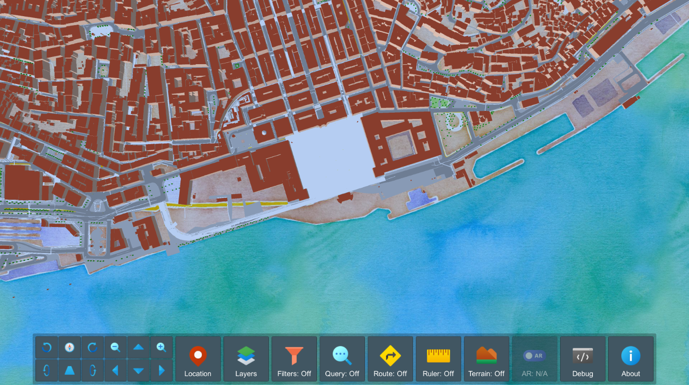
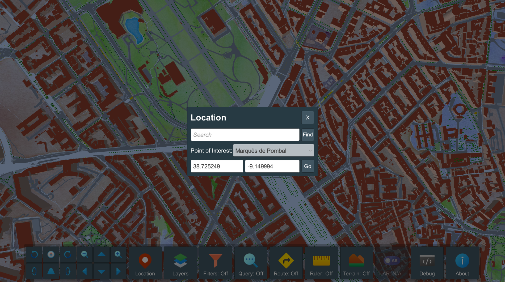
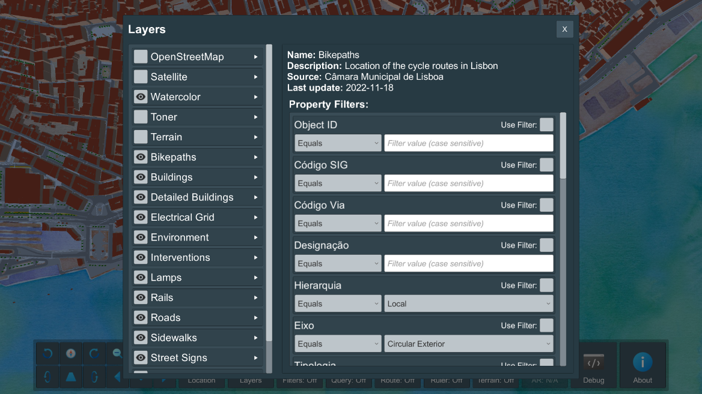
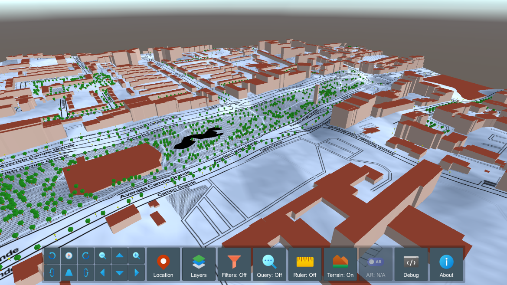
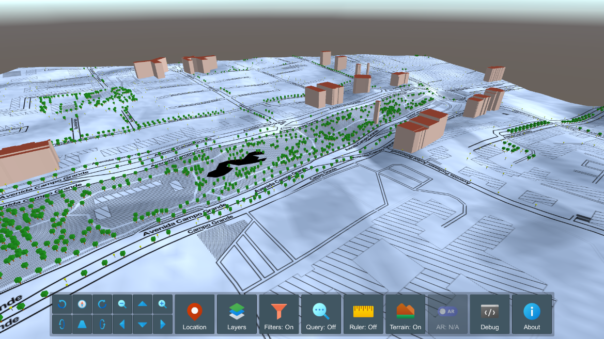
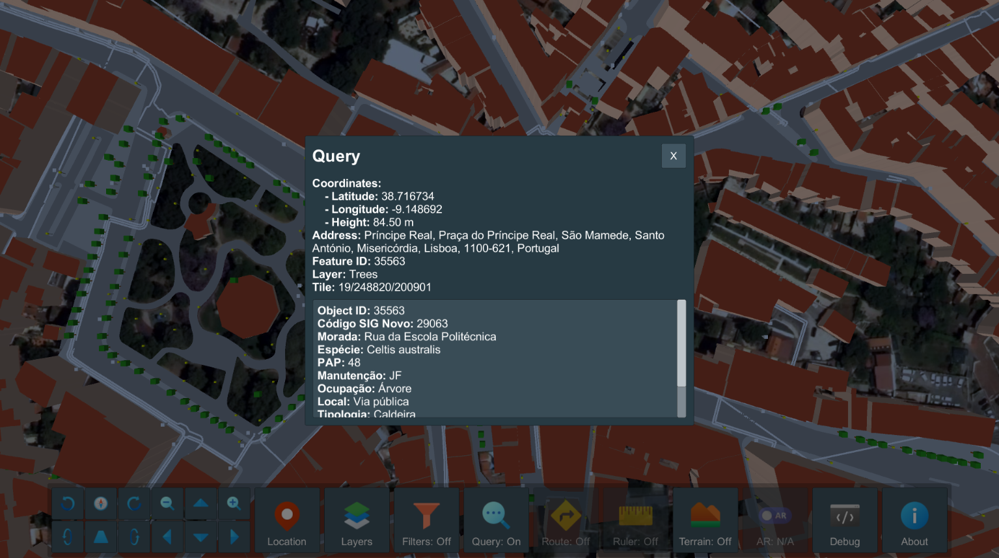
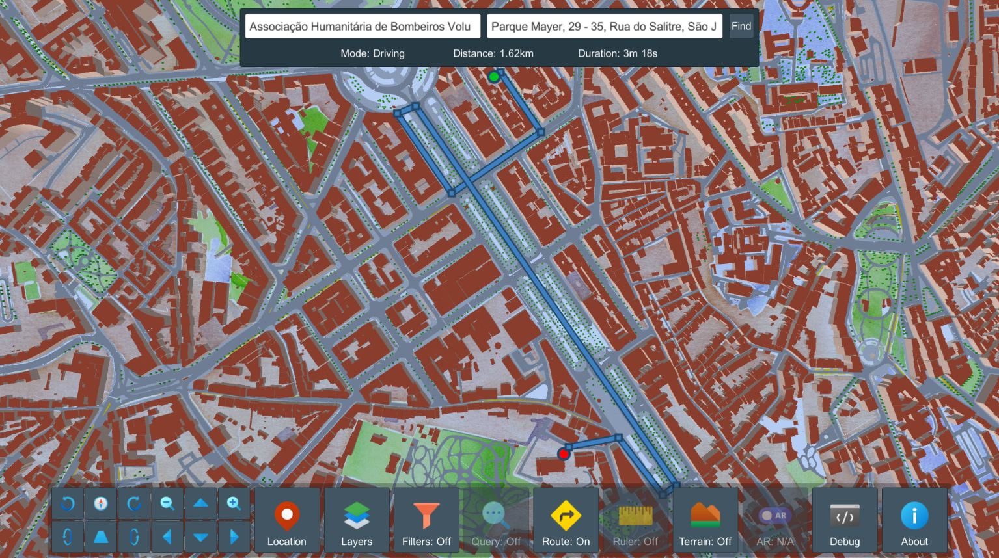
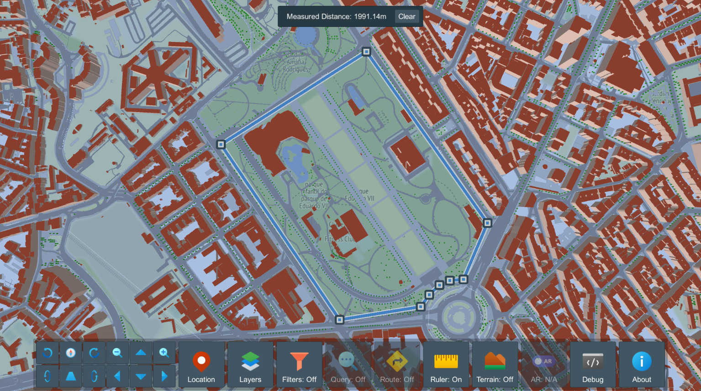
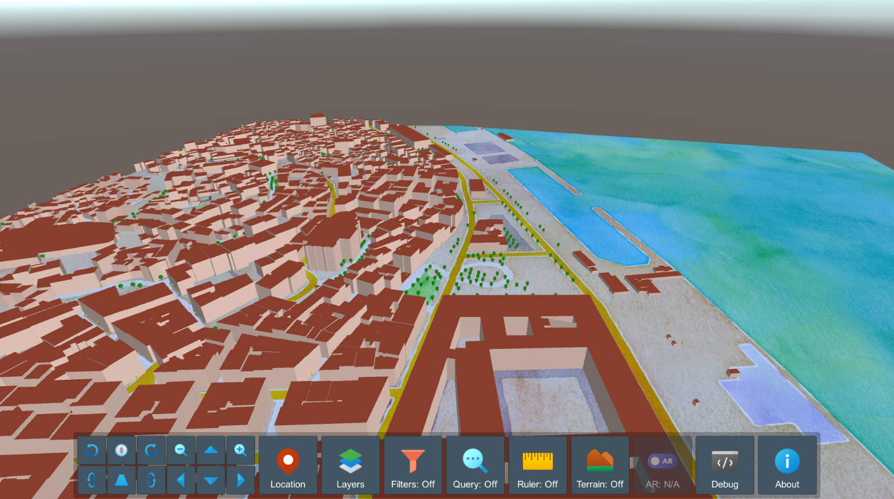
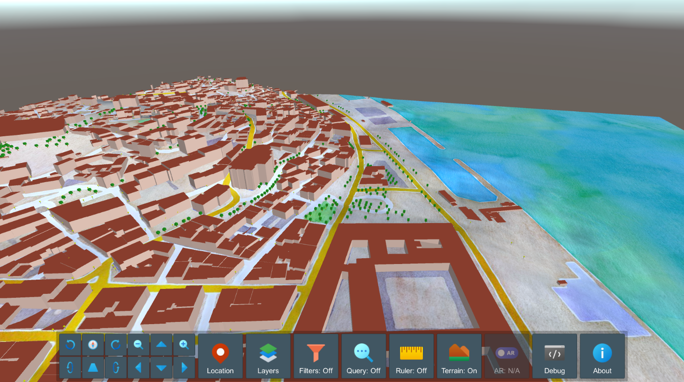
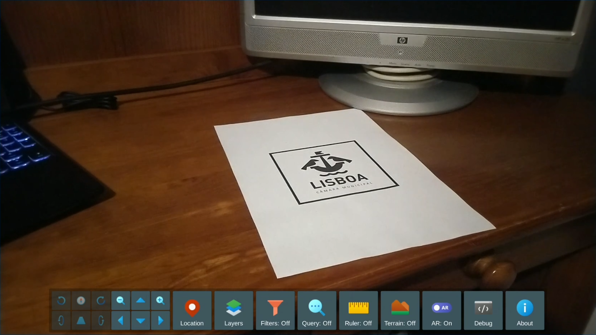
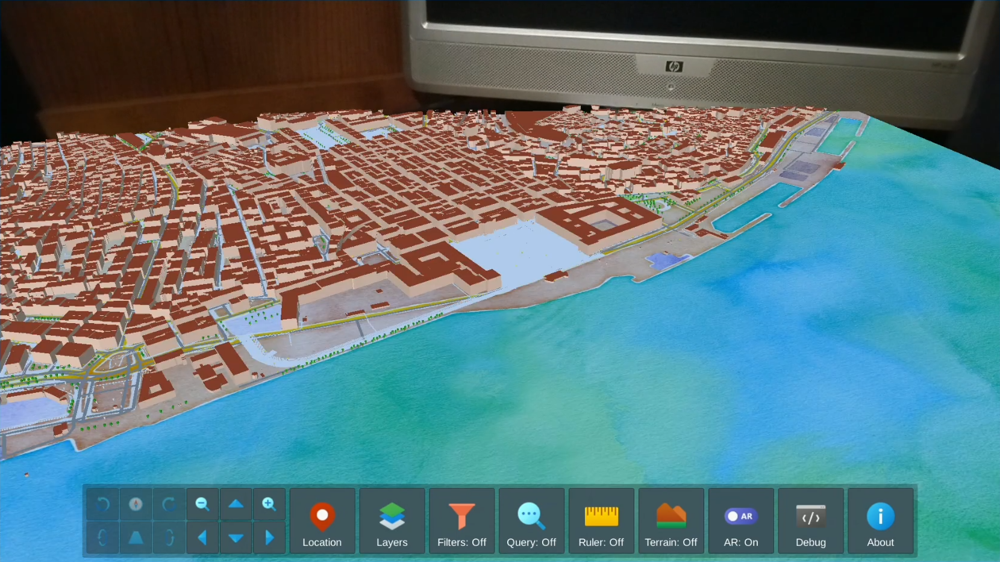
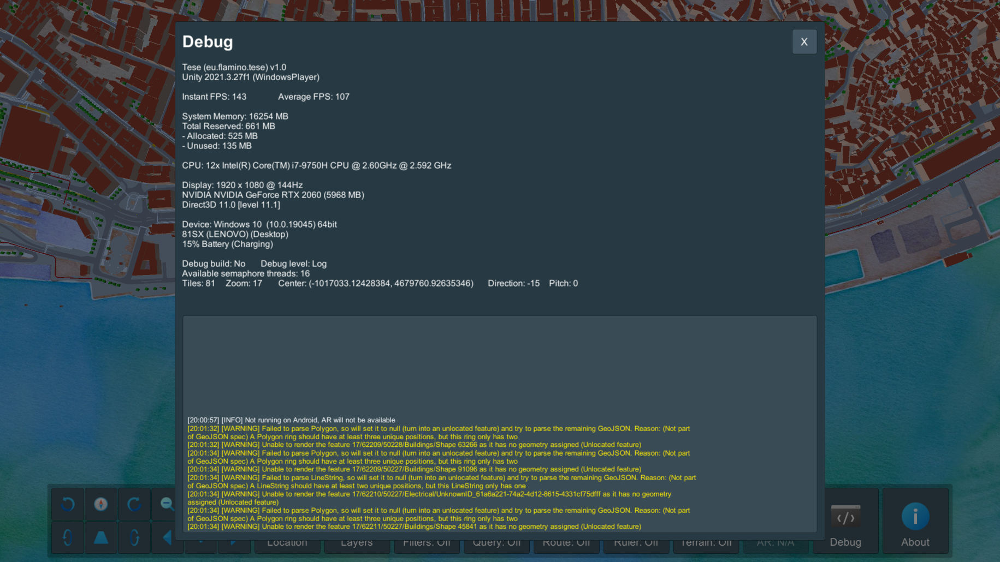
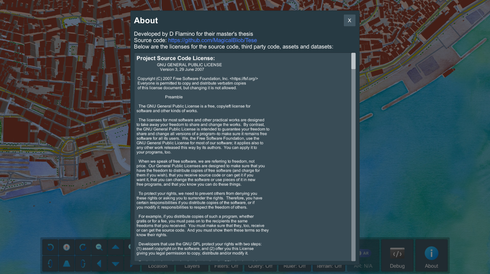

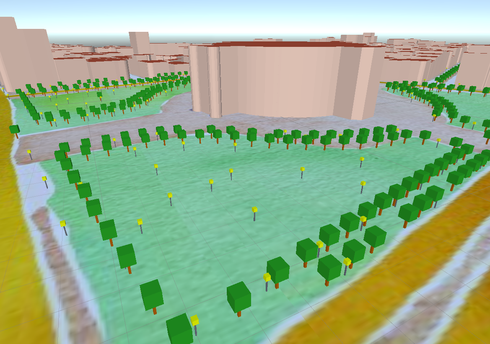

## Licensing

The source code for this project is licensed under the GNU General Public License v3.0 (SPDX-License-Identifier: `GPL-3.0-or-later`).

A copy of this license is available at: [`COPYING`](COPYING)

Regarding the licensing of assets, see the [Assets](#assets) section.

## Ported Code

|  Name  |  Version  | License | Original Source Code |
|--------|-----------|---------|------------|
| Earcut | `2.2.4` | [`LICENSES/earcut/LICENSE`](LICENSES/earcut/LICENSE) | [https://github.com/mapbox/earcut](https://github.com/mapbox/earcut) |
| Global Map Tiles | `---` | [`LICENSES/globalmaptiles/LICENSE`](LICENSES/globalmaptiles/LICENSE) | [https://gist.github.com/maptiler/fddb5ce33ba995d5523de9afdf8ef118](https://gist.github.com/maptiler/fddb5ce33ba995d5523de9afdf8ef118) |

## Assets

UI Icons by [Icons8](https://icons8.com).
